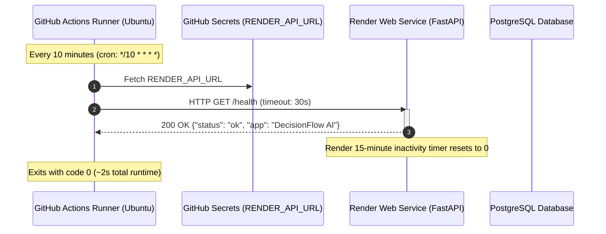

# Backend Keepalive Mechanism (10-Minute Health Probe)

This document explains the technical architecture, timing mechanics, and lifecycle behavior of the keepalive system designed to prevent the Render free-tier backend from spinning down.

---

## 1. The Problem: Render Free-Tier Inactivity Spin-Down

Render's free tier imposes automatic resource reclamation:
- **Inactivity Timeout**: If a free web service receives **no inbound HTTP traffic for 15 consecutive minutes**, Render suspends the container process.
- **Cold Starts**: When a new user request arrives after spin-down, Render must provision a container, pull the image, boot Uvicorn, and establish database pools. This causes a **30–60 second delay (cold start)** for the first user.

```
Without Keepalive:
[ Active ] ──(15 min no traffic)──> [ Asleep ] ──(User arrives)──> [ 50s Cold Start Delay ]
```

---

## 2. The Solution: GitHub Actions Scheduled Health Probe

Rather than running an external third-party monitor service (e.g. UptimeRobot, Cron-Job.org), the project utilizes a **native GitHub Actions workflow** located at [`.github/workflows/keepalive.yml`](file:///d:/Backup%2017-7-26/projects/FollowThrough/.github/workflows/keepalive.yml).

```
With 10-Minute Keepalive:
[ Active ] ──(10 min)──> [ GitHub Action ping /health ] ──> [ Timer resets ] ──> [ Always Warm ]
```

---

## 3. Architecture & Data Flow



---

## 4. Technical Breakdown of the Workflow

The workflow file is defined in `.github/workflows/keepalive.yml`:

```yaml
name: Keep Backend Alive

on:
  schedule:
    # Runs at minute 0, 10, 20, 30, 40, and 50 of every hour
    - cron: "*/10 * * * *"
  # Allows testing on-demand from the GitHub web UI
  workflow_dispatch:

jobs:
  ping:
    name: Ping /health
    runs-on: ubuntu-latest
    timeout-minutes: 2

    steps:
      - name: Ping backend health endpoint
        run: |
          echo "Pinging ${{ secrets.RENDER_API_URL }}/health ..."
          STATUS=$(curl --silent --output /dev/null --write-out "%{http_code}" \
            --max-time 30 \
            "${{ secrets.RENDER_API_URL }}/health")
          echo "HTTP status: $STATUS"
          if [ "$STATUS" -ne 200 ]; then
            echo "::warning::Health check returned $STATUS — backend may be cold-starting or down."
            exit 0   # Prevents workflow failure notifications during temporary delays
          fi
          echo "Backend is healthy."
```

### Key Engineering Details

| Parameter | Configuration | Why It Matters |
| :--- | :--- | :--- |
| **Frequency** | `*/10 * * * *` (Every 10 min) | Shorter than Render's 15-minute idle threshold, guaranteeing the timer never hits expiration. |
| **Endpoint** | `/health` | Lightweight route defined in [`Backend/app/main.py`](file:///d:/Backup%2017-7-26/projects/FollowThrough/Backend/app/main.py). Does not touch expensive database queries or trigger heavy compute. |
| **Timeout** | `--max-time 30` | If the backend is currently cold-starting, curl waits up to 30 seconds before timing out, giving Render sufficient time to wake up. |
| **Failure Tolerance** | `exit 0` on non-200 | If a temporary 502/503 occurs during a deployment or cold start, the job does **not** fail or spam your email with failure alerts. The curl request itself already notified Render to spin up. |
| **Runner Overhead** | `ubuntu-latest` | Takes ~1–2 seconds of compute time per run. |

---

## 5. Free Tier Cost & Limits Analysis

- **GitHub Actions Free Quota**: **2,000 minutes/month** for public/private repositories.
- **Monthly Usage**:
  $$\text{Runs per day} = \frac{24 \times 60}{10} = 144 \text{ runs/day}$$
  $$\text{Monthly execution time} \approx 144 \times 30 \times 2\text{ seconds} \approx 8,640\text{ seconds} \approx 144\text{ minutes/month}$$
- **Quota Utilization**:
  $$\frac{144\text{ minutes}}{2,000\text{ minutes}} \approx \mathbf{7.2\%}$$
  You consume only **~7% of GitHub's free monthly Actions quota**, leaving more than 1,850 minutes for CI/CD builds and tests.

---

## 6. How to Activate the Keepalive

1. Push your code to GitHub.
2. Go to your repository on GitHub:
   - Click **Settings** > **Secrets and variables** > **Actions** > **New repository secret**.
3. Add the secret:
   - **Name**: `RENDER_API_URL`
   - **Value**: `https://decisionflow-api.onrender.com` *(replace with your actual Render service URL)*.
4. Test immediately:
   - Go to the **Actions** tab on GitHub.
   - Select **Keep Backend Alive** from the left sidebar.
   - Click **Run workflow**.
